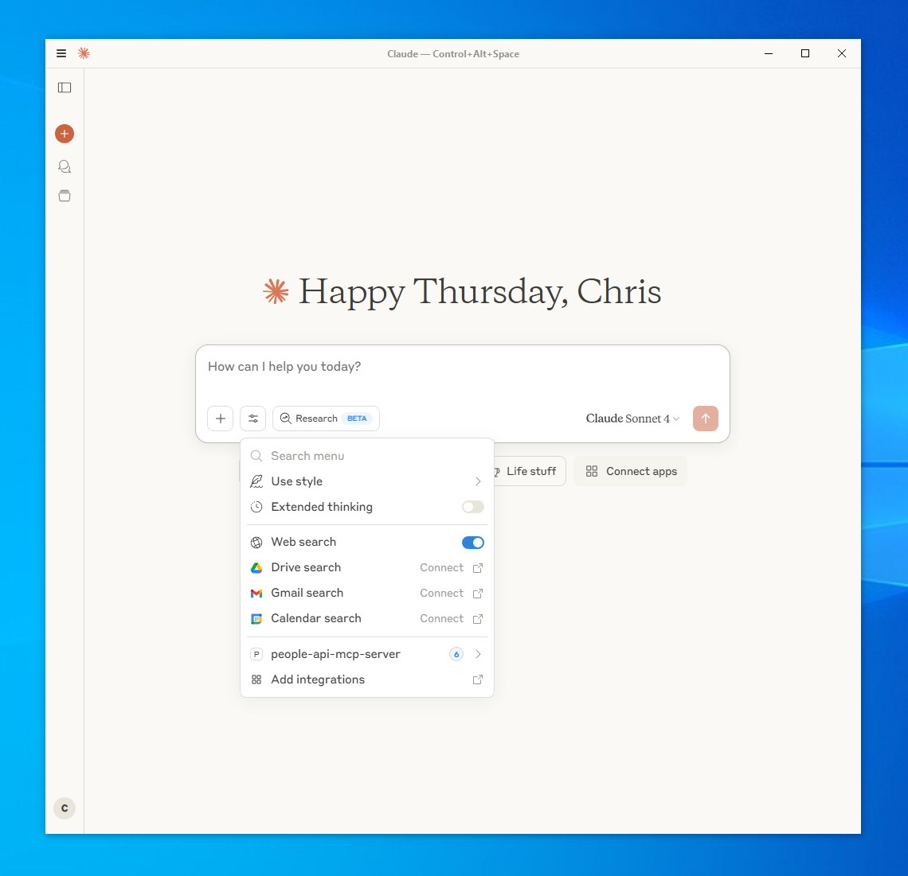

# How to Integrate Your API with Claude Desktop

This guide shows you how to connect your API to Claude Desktop using the Model Context Protocol (MCP), allowing Claude to interact with your tools and data directly.

**Note: Claude Desktop uses stdin to receive messages from your API and stdout to send messages to your API. It does not have a built-in HTTP server, so you will need to create a bridge script to handle the communication. It also requires a JSON-RPC 2.0-compliant API so we want to transform our API responses from plugin to json-rpc2 to be compliant. For this, we need to include a bridge script that will handle the communication between your API and Claude Desktop.**

## Prerequisites

- **Claude Desktop** installed (available at https://claude.ai/download)
- **Node.js** installed on your system
- Your API running and accessible (e.g., `http://127.0.0.1:8000`)

## Step 1: Create the MCP Bridge Script

Create a file called `mcp-http-bridge.js` in a location you can reference (e.g., your Desktop):

```javascript
#!/usr/bin/env node

const MCP_HTTP_URL = process.env.MCP_HTTP_URL || 'http://localhost:8000/mcp';

let buffer = '';

process.stdin.on('data', async (data) => {
  buffer += data.toString();
  
  // Process complete JSON messages
  let lines = buffer.split('\n');
  buffer = lines.pop() || ''; // Keep incomplete line in buffer
  
  for (let line of lines) {
    line = line.trim();
    if (line) {
      await processMessage(line);
    }
  }
});

async function processMessage(message) {
  try {
    const request = JSON.parse(message);
    
    // Handle notifications specially (no response expected)
    if (request.method && request.method.startsWith('notifications/')) {
      // Send to API but don't forward response to Claude
      await fetch(`${MCP_HTTP_URL}/${request.method}`, {
        method: 'POST',
        headers: { 'Content-Type': 'application/json' },
        body: JSON.stringify(request)
      });
      return; // Don't send anything back to Claude for notifications
    }
    
    // Handle regular requests
    const endpoint = request.method.replace('/', '/');
    const response = await fetch(`${MCP_HTTP_URL}/${endpoint}`, {
      method: 'POST',
      headers: { 'Content-Type': 'application/json' },
      body: JSON.stringify(request)
    });
    
    const result = await response.json();
    process.stdout.write(JSON.stringify(result) + '\n');
    
  } catch (error) {
    console.error('Bridge error:', error);
    
    // Try to send a proper error response
    try {
      const request = JSON.parse(message);
      const errorResponse = {
        jsonrpc: "2.0",
        id: request.id || null,
        error: {
          code: -32603,
          message: "Internal error",
          data: error.message
        }
      };
      process.stdout.write(JSON.stringify(errorResponse) + '\n');
    } catch (parseError) {
      // If we can't parse the original request, send error with null id
      const errorResponse = {
        jsonrpc: "2.0",
        id: null,
        error: {
          code: -32700,
          message: "Parse error"
        }
      };
      process.stdout.write(JSON.stringify(errorResponse) + '\n');
    }
  }
}

// Handle process cleanup
process.on('SIGINT', () => process.exit(0));
process.on('SIGTERM', () => process.exit(0));
```

## Step 2: Configure Claude Desktop

### Find Your Configuration File

The Claude Desktop configuration file is located at:

- **macOS**: `~/Library/Application Support/Claude/claude_desktop_config.json`
- **Windows**: `%APPDATA%\Claude\claude_desktop_config.json`

### Create or Edit the Configuration

Add this configuration to your `claude_desktop_config.json` file:

```json
{
  "mcpServers": {
    "your-api-mcp-server": {
      "command": "node",
      "args": ["/path/to/your/mcp-http-bridge.js"],
      "env": {
        "MCP_HTTP_URL": "http://127.0.0.1:8000/mcp"
      }
    }
  }
}
```

**Important**: Replace the following values:
- `/path/to/your/mcp-http-bridge.js` - Full path to your bridge script
- `http://127.0.0.1:8000/mcp` - Your API's base URL

## Step 3: Test the Integration

1. **Start your API** and ensure it's accessible at your configured URL
2. **Restart Claude Desktop** completely (quit and reopen)
3. **Check the integration** by looking for your tools in Claude Desktop's interface
4. **Test a function** by asking Claude to use one of your tools

## Screenshots




## Troubleshooting

### Common Issues

1. **Tools not appearing**: Check that your API endpoints return the correct format
2. **Function calls failing**: Verify your `/mcp/tools/call` endpoint handles the request format correctly
3. **Connection errors**: Ensure your API is running and accessible from Claude Desktop