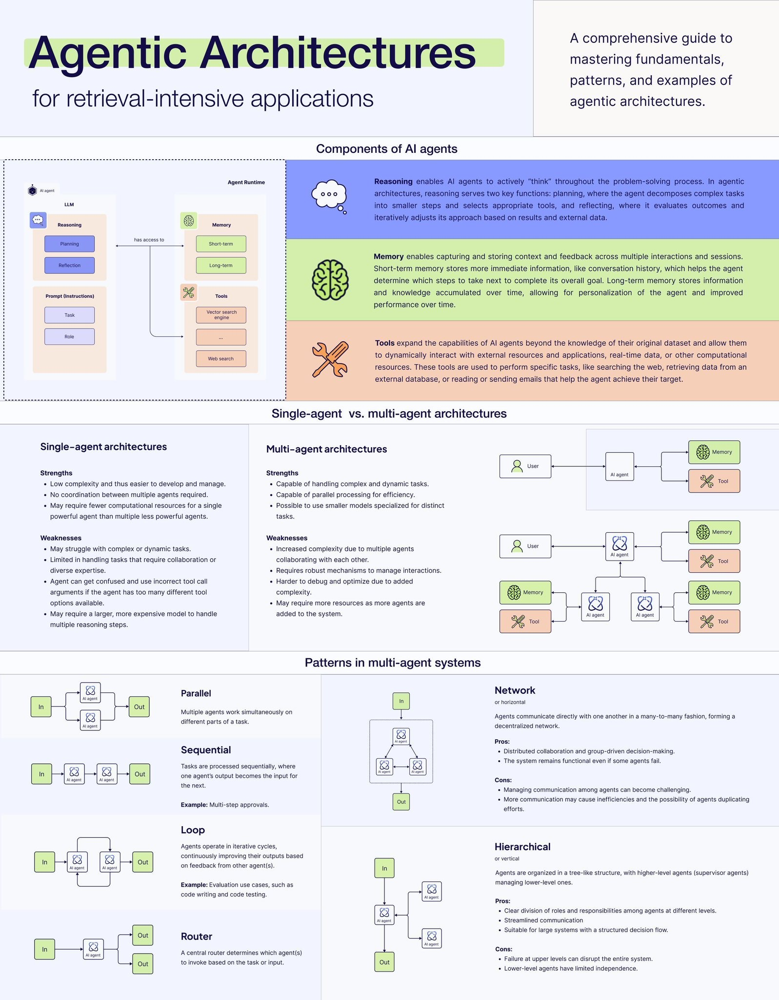

# Agentic Microservices

This is an example of an agentic microservice, where the API exposes plugins and functions for an Agent to call, but also comes with its own
agent through a chat interface, mainly for testing. The agentic microservice architecture is a design pattern that allows for the creation of 
autonomous agents that can perform tasks on behalf of users. It is a variation of the microservices architecture, where each microservice is 
an agent that can perform tasks on behalf of users.

## What is an agent?

An agent is a program that can act on behalf of a user. It can be a chatbot, a virtual assistant, or any other program that can perform actions on behalf of a user. 

### Core Components:

- Plugins and Functions: Agents leverage SK's plugin architecture to access various capabilities, from calling APIs to performing calculations or text processing
- Planning Capabilities: Agents can create and execute multi-step plans to accomplish complex tasks, often using SK's planner functionality
- Memory and Context: Agents maintain conversational context and can store/retrieve information across interactions
- Prompt Engineering: They utilize carefully crafted prompts and prompt templates to guide AI model behavior

### Behavioral Attributes:

- Autonomy: Agents can operate independently, making decisions about which functions to call and how to sequence actions
- Goal-Oriented: They work toward specific objectives, whether explicitly stated or inferred from context
- Conversational: Agents can engage in natural language interactions while performing tasks
- Adaptive: They can adjust their approach based on feedback, errors, or changing requirements

## Agentic Architectures

This solution works with various agentic architectures, such as 

