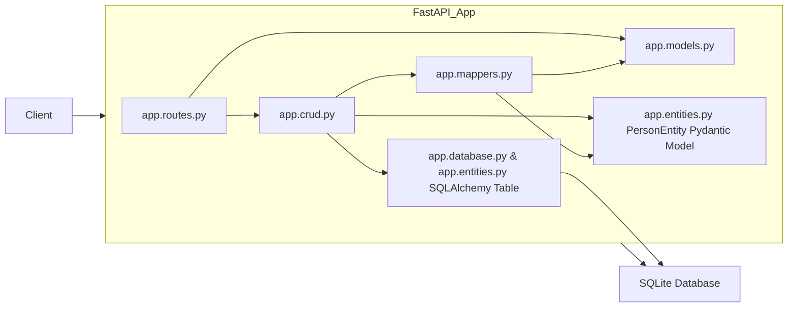
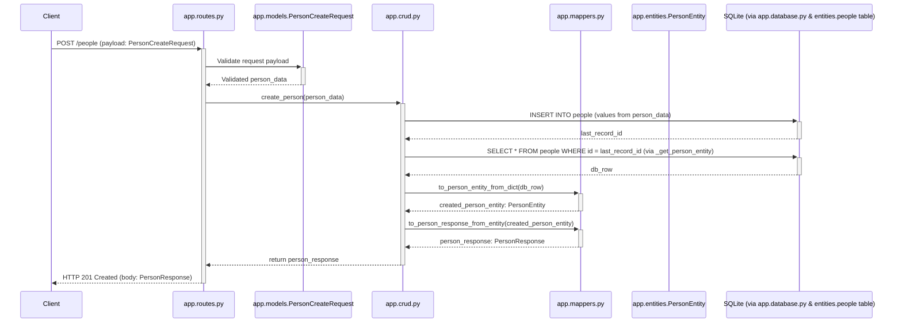

# Solution Architecture

This document outlines the architecture of the Python FastAPI microservice for managing people.

## High-Level Component Diagram

This diagram shows the main components of the application and their interactions.

**Components:**

*   **Client**: Any HTTP client (e.g., browser, mobile app, another service) that consumes the API.
*   **FastAPI Application**: The core of the service.
    *   **`app.routes.py` (Router)**: Handles incoming HTTP requests for the `/people` endpoint. It uses API Models for request validation and response serialization and delegates business logic to the CRUD layer.
    *   **`app.models.py` (API Models)**: Contains Pydantic models (`PersonCreateRequest`, `PersonUpdateRequest`, `PersonResponse`) that define the structure of API request and response bodies. Ensures data validation.
    *   **`app.crud.py` (CRUD Layer)**: Implements the core business logic for Create, Read, Update, and Delete operations on people. It uses Mappers to convert between API models and database entities.
    *   **`app.mappers.py` (Mappers)**: Provides functions to translate data between API models (from `app.models.py`) and the internal `PersonEntity` Pydantic model (from `app.entities.py`).
    *   **`app.entities.py` (Database Entities & Model)**:
        *   Defines the SQLAlchemy `people` table structure.
        *   Contains the `PersonEntity` Pydantic model, which represents a person record as used internally by the CRUD and Mapper layers after retrieval from or before insertion/update to the database.
    *   **`app.database.py` (Database Interface)**: Manages the database connection (using `databases` library) and provides functions to execute SQL queries.
*   **SQLite Database**: The relational database used to store person data.

## Sequence Diagram: Create Person

This diagram shows the sequence of interactions when a client creates a new person.

