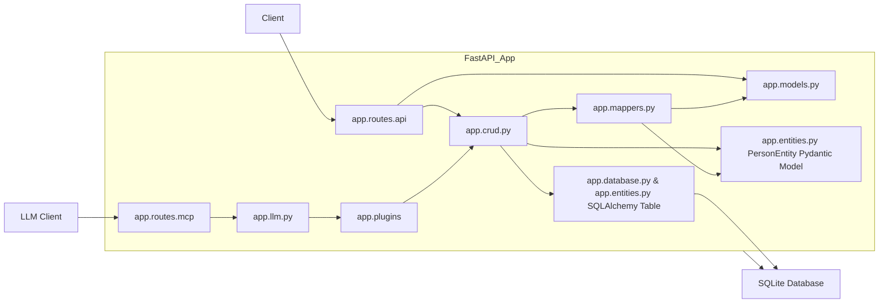
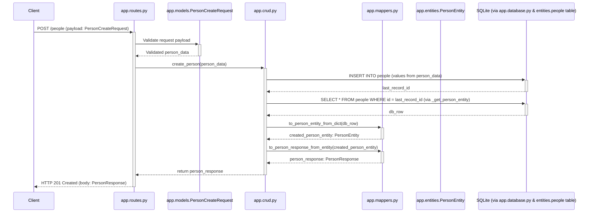
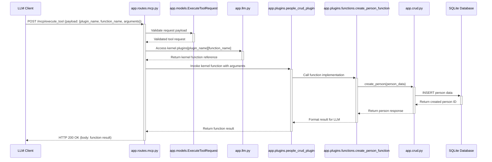
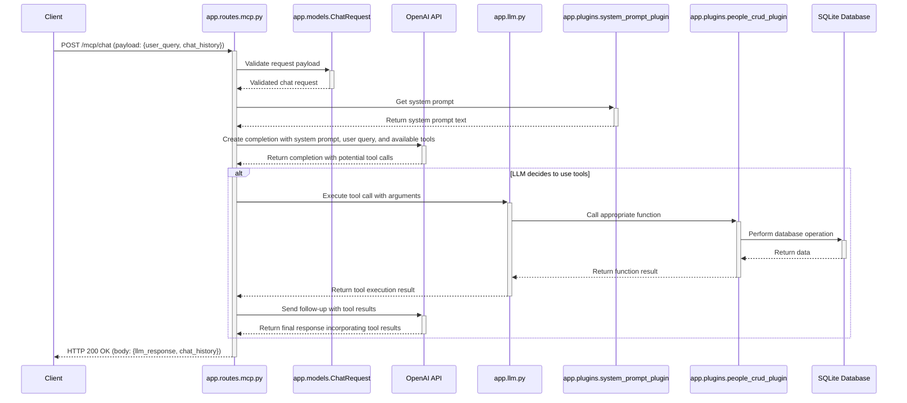

# Solution Architecture

This document outlines the architecture of the Python FastAPI microservice for managing people, including the LLM integration via Model Context Protocol (MCP).

## High-Level Component Diagram

This diagram shows the main components of the application and their interactions.

**Components:**

*   **Client**: Any HTTP client (e.g., browser, mobile app, another service) that consumes the API.
*   **LLM_Client**: An AI language model client (e.g., OpenAI, Claude, Azure OpenAI) that interacts with the API via the MCP endpoints.
*   **FastAPI Application**: The core of the service.
    *   **`app.routes/api.py` (Router)**: Handles incoming HTTP requests for the `/people` endpoint. It uses API Models for request validation and response serialization and delegates business logic to the CRUD layer.
    *   **`app.routes/mcp.py` (MCP Router)**: Implements the Model Context Protocol endpoints that allow LLMs to interact with the application's functionality.
    *   **`app.models.py` (API Models)**: Contains Pydantic models (`PersonCreateRequest`, `PersonUpdateRequest`, `PersonResponse`) that define the structure of API request and response bodies, as well as models for MCP requests and responses.
    *   **`app.crud.py` (CRUD Layer)**: Implements the core business logic for Create, Read, Update, and Delete operations on people. It uses Mappers to convert between API models and database entities.
    *   **`app.mappers.py` (Mappers)**: Provides functions to translate data between API models (from `app.models.py`) and the internal `PersonEntity` Pydantic model (from `app.entities.py`).
    *   **`app.entities.py` (Database Entities & Model)**:
        *   Defines the SQLAlchemy `people` table structure.
        *   Contains the `PersonEntity` Pydantic model, which represents a person record as used internally by the CRUD and Mapper layers.
    *   **`app.database.py` (Database Interface)**: Manages the database connection and provides functions to execute SQL queries.
    *   **`app.llm.py` (LLM Integration)**: Sets up the Semantic Kernel integration with OpenAI and configures the LLM plugins.
    *   **`app.plugins/` (Semantic Kernel Plugins)**: Contains plugins that expose application functionality to LLMs.
        *   **`people_crud_plugin.py`**: Plugin that wraps CRUD operations for LLM access.
        *   **`system_prompt_plugin.py`**: Plugin that provides system prompts to guide LLM behavior.
        *   **`functions/`**: Directory containing individual function implementations for each plugin.
*   **SQLite Database**: The relational database used to store person data.

## Sequence Diagram: Create Person

This diagram shows the sequence of interactions when a client creates a new person.

## Sequence Diagram: MCP Tool Execution

This diagram shows the sequence of interactions when an LLM client uses the MCP to execute a tool function (e.g., creating a person).

## Sequence Diagram: MCP Chat Interaction

This diagram shows the sequence of interactions when a user interacts with the API via the MCP chat endpoint, allowing the LLM to decide which tools to use.

