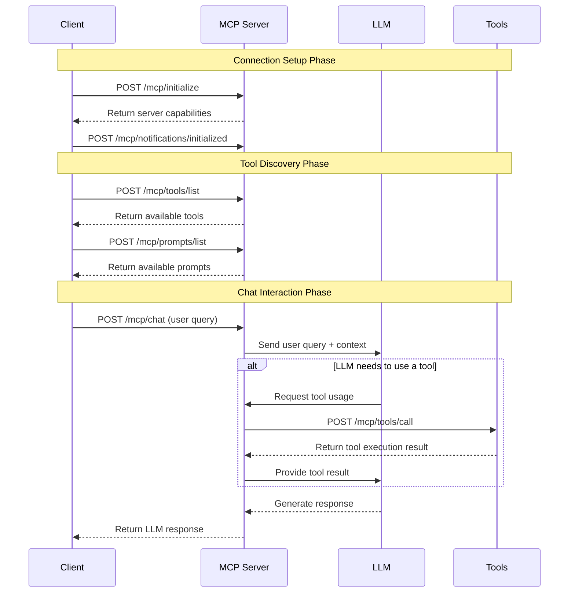

# Model Context Protocol (MCP) Documentation

## What is MCP?

The Model Context Protocol (MCP) is a standardized interface for AI language models to interact with external tools, data sources, and services. In the context of AI applications, MCP enables:

1. **Tool Usage**: Allowing language models to call external functions when needed to complete tasks.
2. **Contextual Understanding**: Providing AI models with additional context beyond their training data.
3. **Standardized Communication**: Establishing a consistent protocol for AI systems to communicate with external services.
4. **Plugin Architecture**: Supporting an extensible design where new capabilities can be added as plugins.

This implementation uses Semantic Kernel's plugin architecture to expose functionality to large language models (LLMs), enabling them to perform actions like creating, retrieving, updating, and deleting people records through a well-defined API.

## Available MCP Endpoints

An MCP server typically exposes the following standard endpoint types:

1. **Core Endpoints**:
   - `/mcp/initialize`: Establishes initial connection with client information
   - `/mcp/tools/list`: Returns available tools and functions in the MCP
   - `/mcp/tools/call`: Executes specific tool functions

2. **Notification Endpoints**:
   - `/mcp/notifications/initialized`: Handles client initialization notifications
   - `/mcp/notifications/cancelled`: Processes request cancellation notifications

3. **Resource Endpoints**:
   - `/mcp/resources/list`: Provides access to available resources
   - `/mcp/prompts/list`: Returns available prompts for LLMs

4. **Chat Endpoints**:
   - `/mcp/chat`: Enables interactive conversations where the LLM can use tools dynamically

These standardized endpoints create a consistent interface for AI models to communicate with external services and access functionality beyond their training data.

### MCP Endpoint Flow for Chat Interactions

The following diagram illustrates the typical flow of endpoint calls when interacting with a chatbot that uses MCP:



This diagram shows how a client application interacts with an MCP server during a chat session, including the initialization process, tool discovery, and the dynamic use of tools during conversation.

## API Endpoints

### Core MCP Endpoints

#### 1. `/mcp/initialize`

- **Method**: POST
- **Description**: Initialize the connection with client information.
- **Purpose**: This is the first endpoint called by MCP clients to establish a connection.
- **Request Body**: JSON object following the JSON-RPC format.
- **Example Request**:
  ```json
  {
    "method": "initialize",
    "params": {
      "clientInfo": {
        "name": "Claude Desktop",
        "version": "1.0.0"
      }
    },
    "id": 1,
    "jsonrpc": "2.0"
  }
  ```
- **Example Response**:
  ```json
  {
    "jsonrpc": "2.0",
    "id": 1,
    "result": {
      "name": "People API - MCP Support",
      "version": "1.0.0",
      "protocolVersion": "2024-11-05",
      "capabilities": {
        "completions": false,
        "tools": true,
        "embeddings": false
      }
    }
  }
  ```

#### 2. `/mcp/tools/list`

- **Method**: POST (preferred) or GET
- **Description**: Returns a list of available plugins and their functions in JSON-RPC format.
- **Purpose**: This endpoint is used by clients to discover available tools.
- **Request Body**: JSON-RPC formatted object for POST method.
- **Example Request**:
  ```json
  {
    "method": "tools/list",
    "params": {},
    "id": 1,
    "jsonrpc": "2.0"
  }
  ```
- **Response**: JSON-RPC formatted object with tool definitions in MCP format.

#### 3. `/mcp/tools/call`

- **Method**: POST
- **Description**: Executes a specific tool function using JSON-RPC format.
- **Purpose**: This endpoint is used by clients to call specific functions.
- **Request Body**: JSON-RPC formatted object with method, params, and id.
- **Example Request**: See examples in the "Example Payloads" section below
- **Response**: JSON-RPC formatted object with the execution result formatted as content array or error details.

### Notification Endpoints

#### 4. `/mcp/notifications/initialized`

- **Method**: POST
- **Description**: Handles client initialization notifications.
- **Purpose**: Notification from client that initialization is complete.
- **Request Body**: JSON-RPC notification object.
- **Response**: No content (204 status code)

#### 5. `/mcp/notifications/cancelled`

- **Method**: POST
- **Description**: Handles cancellation notifications.
- **Purpose**: Notification from client that a request was cancelled.
- **Request Body**: JSON-RPC notification object.
- **Response**: No content (204 status code)

### Resource and Prompt Endpoints

#### 6. `/mcp/resources/list`

- **Method**: GET or POST
- **Description**: Returns a list of available resources (currently none).
- **Purpose**: Used by clients to discover available resources.
- **Request Body**: JSON-RPC formatted object for POST method.
- **Response**: Empty resources list in JSON-RPC format.
  ```json
  {
    "jsonrpc": "2.0",
    "id": 1,
    "result": {
      "resources": []
    }
  }
  ```

#### 7. `/mcp/prompts/list`

- **Method**: GET or POST
- **Description**: Returns a list of available prompts (currently none).
- **Purpose**: Used by clients to discover available prompts.
- **Request Body**: JSON-RPC formatted object for POST method.
- **Response**: Empty prompts list in JSON-RPC format.
  ```json
  {
    "jsonrpc": "2.0",
    "id": 1,
    "result": {
      "prompts": []
    }
  }
  ```

## Available Plugins and Functions

### 1. PeopleCRUD Plugin

Provides CRUD operations for managing people records.

#### Functions:

1. `create_person`
   - **Description**: Creates a new person in the system.
   - **Parameters**: 
     - `person_data_json`: JSON string with required fields 'first_name', 'last_name' and optional fields 'age', 'email'.
   - **Returns**: Details of the created person.

2. `get_person_by_id`
   - **Description**: Retrieves a specific person by their unique ID.
   - **Parameters**: 
     - `person_id`: Integer ID of the person to retrieve.
   - **Returns**: Person details if found.

3. `get_all_people`
   - **Description**: Retrieves a list of all people with pagination support.
   - **Parameters**: 
     - `skip`: Number of records to skip (default: 0).
     - `limit`: Maximum number of records to return (default: 100).
   - **Returns**: List of people.

4. `update_person_by_id`
   - **Description**: Updates an existing person by their unique ID.
   - **Parameters**: 
     - `person_id`: Integer ID of the person to update.
     - `person_update_data_json`: JSON string with fields to update ('first_name', 'last_name', 'age', 'email').
   - **Returns**: Updated person details.

5. `delete_person_by_id`
   - **Description**: Deletes a person by their unique ID.
   - **Parameters**: 
     - `person_id`: Integer ID of the person to delete.
   - **Returns**: Confirmation message.

### 2. SystemPrompt Plugin

Provides system prompts for the LLM.

#### Functions:

1. `get_system_prompt`
   - **Description**: Returns a system prompt string that informs the LLM about available tools and their usage.
   - **Parameters**: None
   - **Returns**: Detailed system prompt text.

## Example Payloads

### JSON-RPC Format (for `/mcp/tools/call`)

Here are example payloads using the new JSON-RPC style format:

**Getting the system prompt**
```json
{
  "method": "tools/call",
  "params": {
    "name": "get_system_prompt",
    "plugin": "SystemPrompt",
    "arguments": {}
  },
  "id": 1,
  "jsonrpc": "2.0"
}
```

**Creating a new person**
```json
{
  "method": "tools/call",
  "params": {
    "name": "create_person",
    "plugin": "PeopleCRUD",
    "arguments": {
      "person_data_json": "{\"first_name\": \"John\", \"last_name\": \"Doe\", \"age\": 30, \"email\": \"john.doe@example.com\"}"
    }
  },
  "id": 1,
  "jsonrpc": "2.0"
}
```

**Getting a specific person by ID**
```json
{
  "method": "tools/call",
  "params": {
    "name": "get_person_by_id",
    "plugin": "PeopleCRUD",
    "arguments": { "person_id": 1 }
  },
  "id": 1,
  "jsonrpc": "2.0"
}
```

**Getting all people with pagination**
```json
{
  "method": "tools/call",
  "params": {
    "name": "get_all_people",
    "plugin": "PeopleCRUD",
    "arguments": { "skip": 0, "limit": 10 }
  },
  "id": 1,
  "jsonrpc": "2.0"
}
```

## Usage with Chat

The `/mcp/chat` endpoint enables interactive conversations where the LLM can dynamically choose to use tools when appropriate. Example request(s):

```json
{
  "user_query": "How many people are in the database?"
}
```

```json
{
  "user_query": "Please add a new person named Alice Smith who is 28 years old."
}
```

You are welcome to pass through conversation history to the LLM to help it understand context.

```json
{
  "user_query": "Show me the details of that user",
  "chat_history": [
    {
      "role": "user",
      "content": "How many users do we have with the last name Fryer, and whats the ids?"
    },
    {
      "role": "assistant",
      "content": "There is 1 user with the last name Fryer. The user's ID is 1.\n\n[Used tools: PeopleCRUD_get_all_people]"
    }
  ]
}
```

## Extending MCP with New Plugins

To add new plugins to this MCP implementation:

1. Create a new plugin class with methods decorated with `@kernel_function`
2. Add detailed descriptions for each function using the decorator parameters
3. Define parameter metadata using `KernelParameterMetadata`
4. Register your plugin with the kernel in `app/llm.py`
5. Update the system prompt in `SystemPromptPlugin` to describe the new functionality
