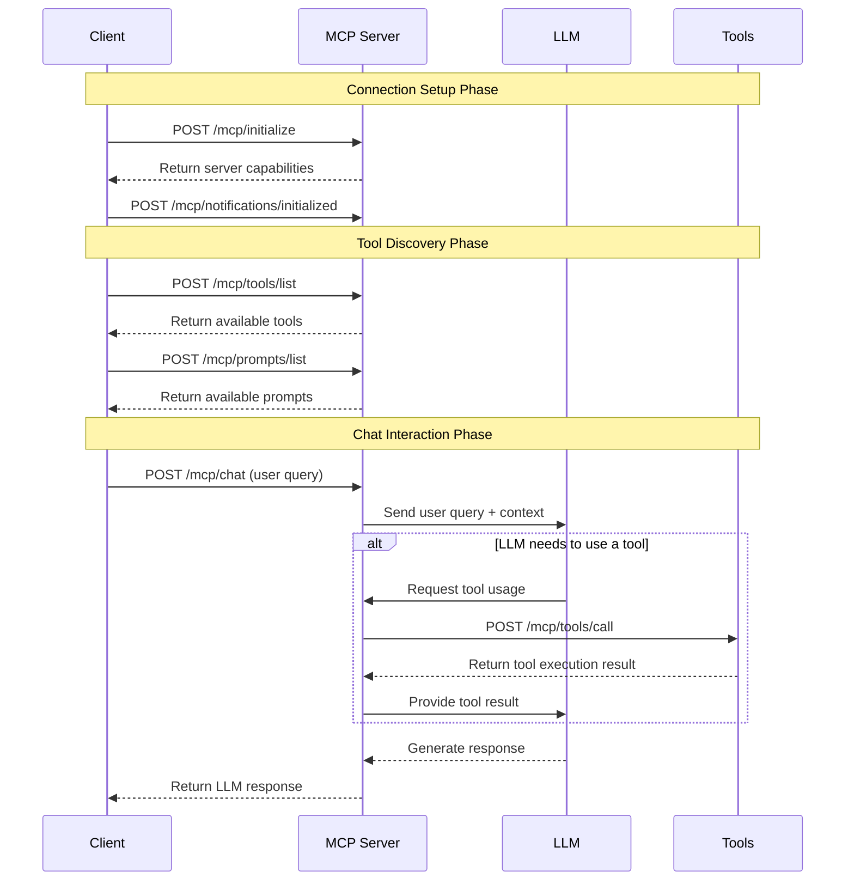

# Model Context Protocol (MCP) Documentation

## What is MCP?

The Model Context Protocol (MCP) is a standardized interface for AI language models to interact with external tools, data sources, and services. MCP is built on top of function calling and extends it with additional capabilities.

1. **Tool Usage**: Allowing language models to call external functions when needed to complete tasks.
2. **Contextual Understanding**: Providing AI models with additional context beyond their training data.
3. **Standardized Communication**: Establishing a consistent protocol for AI systems to communicate with external services.

## MCP Endpoints

An MCP (REST) server typically exposes the following standard endpoint types:

1. **Core Endpoints**:
   - `/mcp/initialize`: Establishes initial connection with client information, helps the model understand which capabilities are available.
   - `/mcp/tools/list`: Returns available tools and functions in the MCP, helps the model understand what tools are available.
   - `/mcp/tools/call`: Executes specific tool functions, allows the model to call tools when needed.

2. **Notification Endpoints**:
   - `/mcp/notifications/initialized`: Handles client initialization notifications
   - `/mcp/notifications/cancelled`: Processes request cancellation notifications

3. **Resource Endpoints**:
   - `/mcp/resources/list`: Lists all available resources
   - `/mcp/resources/get`: Provides access to a specific resource
   - `/mcp/prompts/list`: Returns available prompts for LLMs
   - `/mcp/prompts/get`: Provides access to a specific prompt

These standardized endpoints create a consistent interface for AI models to communicate with external services and access functionality beyond their training data.

## Semantic Kernel, does it have MCP?

Yes, Semantic Kernel has MCP support built-in, with the caveat that if you use stdio as your transport layer, its fully automated and you don't have to worry about any of the MCP endpoints, however if you wish to expose your MCP functionality over REST, you will need to create the endpoints and DTOs yourself.

## So, MCP all the things right?

Not really, MCP is really cool and powerful but... In my opinion, it is best used for workflow automation that require interaction with external tools, data sources, and services. Given the security concerns, it is not my recommendation to use MCP for sensitive data or for production applications where performance and authorization is a concern. See **Security Concerns** below.

## Security Concerns

MCP introduces several categories of security concerns, while this is not an exhaustive list, but these are my primary concerns:

**Access Control and Permissions**

MCPs can grant language models access to external systems, databases, APIs, and local resources. Without proper permission boundaries, a compromised or malicious MCP could potentially access sensitive data, modify critical systems, or perform unauthorized actions. The challenge is implementing granular access controls that limit what each MCP can do while maintaining functionality.

**Code Execution Risks**

Many MCPs involve executing code or commands on behalf of the model, whether through direct code execution, shell commands, or API calls. This creates risks around code injection, where malicious input could be crafted to execute unintended commands. Sandboxing and input validation become critical for these types of MCPs.

**Data Exposure and Privacy**

MCPs that handle sensitive data (personal information, business data, credentials) create potential exposure points. There's risk of data leakage through logs, error messages, or insecure transmission. Additionally, the model itself might inadvertently expose sensitive information it accessed through MCPs in its responses.

**Input Validation and Injection**

MCPs that process user input or model-generated content are vulnerable to various injection attacks. This includes SQL injection if interacting with databases, command injection for system operations, or prompt injection where malicious prompts could manipulate the MCP's behavior.

## Authentication

Authentication with MCPs is a complex topic, and there are several approaches you can take to secure your MCP server and its interactions with external services. Here are some common patterns:

**Trusted Service Approach:** The recommended pattern is to configure your MCP server as a trusted service that manages credentials securely. The server handles all authentication details internally, while the AI model simply makes requests through the MCP interface without needing to know about underlying auth mechanisms.

**OAuth Integration:** OAuth authentication happens at the transport layer between your MCP server and external services. When a user needs to authenticate, the MCP server can return a clickable authorization URL that opens the OAuth provider's login page. Once the user completes authentication, the server stores the resulting access and refresh tokens securely (typically encrypted in a local database or secure file). The MCP server then automatically handles token refresh and includes valid tokens in API requests, all transparent to the AI model.

**Mutual TLS (mTLS):** For high-security environments, mTLS operates at the transport layer where both the MCP server and external service authenticate each other using certificates during the TLS handshake. This provides strong cryptographic authentication before any application data is exchanged and is particularly useful for enterprise or financial services integrations.

## MCP Endpoint Flow for Chat Interactions

The following diagram illustrates the typical flow of endpoint calls when interacting with a chatbot that uses MCP:



This diagram shows how a client application interacts with an MCP server during a chat session, including the initialization process, tool discovery, and the dynamic use of tools during conversation.

# Technical Breakdown

## Core MCP Endpoints

#### 1. `/mcp/initialize`

- **Method**: POST
- **Description**: Initialize the connection with client information.
- **Purpose**: This is the first endpoint called by MCP clients to establish a connection.
- **Request Body**: JSON object following the JSON-RPC format.
- **Example Request**:
  ```json
  {
    "method": "initialize",
    "params": {
      "clientInfo": {
        "name": "Claude Desktop",
        "version": "1.0.0"
      }
    },
    "id": 1,
    "jsonrpc": "2.0"
  }
  ```
- **Example Response**:
  ```json
  {
    "jsonrpc": "2.0",
    "id": 1,
    "result": {
      "name": "People API - MCP Support",
      "version": "1.0.0",
      "protocolVersion": "2024-11-05",
      "capabilities": {
        "completions": false,
        "tools": true,
        "embeddings": false,
        "resources": true,
        "prompts": true,
        ...
      }
    }
  }
  ```

- **Capability Details**:
  - `completions`: Indicates whether the server supports direct text completion generation endpoints.
  - `tools`: Indicates whether the server supports tool calling functionality for AI models.
  - `embeddings`: Indicates whether the server can generate vector embeddings for text.
  - `resources`: Indicates whether the server provides access to external resources like files or databases.
  - `prompts`: Indicates whether the server offers predefined prompt templates for use with AI models.

#### 2. `/mcp/tools/list`

- **Method**: POST (preferred) or GET
- **Description**: Returns a list of available plugins and their functions in JSON-RPC format.
- **Purpose**: This endpoint is used by clients to discover available tools.
- **Request Body**: JSON-RPC formatted object for POST method.
- **Example Request**:
  ```json
  {
    "method": "tools/list",
    "params": {},
    "id": 1,
    "jsonrpc": "2.0"
  }
  ```
- **Response**: JSON-RPC formatted object with tool definitions in MCP format.

#### 3. `/mcp/tools/call`

- **Method**: POST
- **Description**: Executes a specific tool function using JSON-RPC format.
- **Purpose**: This endpoint is used by clients to call specific functions.
- **Request Body**: JSON-RPC formatted object with method, params, and id.
- **Example Request**: See examples in the "Example Payloads" section below
- **Response**: JSON-RPC formatted object with the execution result formatted as content array or error details.

### Notification Endpoints

#### 4. `/mcp/notifications/initialized`

- **Method**: POST
- **Description**: Handles client initialization notifications.
- **Purpose**: Notification from client that initialization is complete.
- **Request Body**: JSON-RPC notification object.
- **Response**: No content (204 status code)

#### 5. `/mcp/notifications/cancelled`

- **Method**: POST
- **Description**: Handles cancellation notifications.
- **Purpose**: Notification from client that a request was cancelled.
- **Request Body**: JSON-RPC notification object.
- **Response**: No content (204 status code)

### Resource and Prompt Endpoints

#### 6. `/mcp/resources/list`

- **Method**: GET or POST
- **Description**: Returns a list of available resources (currently none).
- **Purpose**: Used by clients to discover available resources.
- **Request Body**: JSON-RPC formatted object for POST method.
- **Response**: Empty resources list in JSON-RPC format.
  ```json
  {
    "jsonrpc": "2.0",
    "id": 1,
    "result": {
      "resources": []
    }
  }
  ```

#### 7. `/mcp/prompts/list`

- **Method**: GET or POST
- **Description**: Returns a list of available prompts (currently none).
- **Purpose**: Used by clients to discover available prompts.
- **Request Body**: JSON-RPC formatted object for POST method.
- **Response**: Empty prompts list in JSON-RPC format.
  ```json
  {
    "jsonrpc": "2.0",
    "id": 1,
    "result": {
      "prompts": []
    }
  }
  ```

## Example Payloads

### JSON-RPC Format (for `/mcp/tools/call`)

Here are example payloads using the new JSON-RPC style format:

**Getting the system prompt**
```json
{
  "method": "tools/call",
  "params": {
    "name": "get_system_prompt",
    "plugin": "SystemPrompt",
    "arguments": {}
  },
  "id": 1,
  "jsonrpc": "2.0"
}
```

**Creating a new person**
```json
{
  "method": "tools/call",
  "params": {
    "name": "create_person",
    "plugin": "PeopleCRUD",
    "arguments": {
      "person_data_json": "{\"first_name\": \"John\", \"last_name\": \"Doe\", \"age\": 30, \"email\": \"john.doe@example.com\"}"
    }
  },
  "id": 1,
  "jsonrpc": "2.0"
}
```

**Getting a specific person by ID**
```json
{
  "method": "tools/call",
  "params": {
    "name": "get_person_by_id",
    "plugin": "PeopleCRUD",
    "arguments": { "person_id": 1 }
  },
  "id": 1,
  "jsonrpc": "2.0"
}
```

**Getting all people with pagination**
```json
{
  "method": "tools/call",
  "params": {
    "name": "get_all_people",
    "plugin": "PeopleCRUD",
    "arguments": { "skip": 0, "limit": 10 }
  },
  "id": 1,
  "jsonrpc": "2.0"
}
```